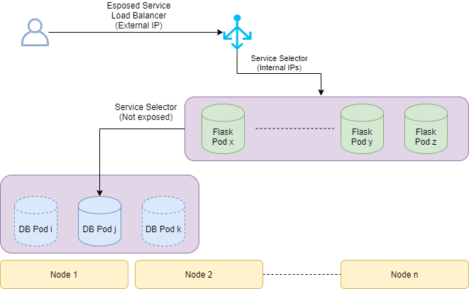

# Embracing Kubernetes - Cloud Native Applications

*Getting started with containerization*

## Requirements

Before starting with the workshop, it'd be useful to:
* Download this git [repo](https://github.com/pmbrull/k8s-workshop.git).
* Install Docker on your machine. You can follow the official [guide](https://docs.docker.com/install/).
* To run Kubernetes locally, you can make use of [minikube](https://minikube.sigs.k8s.io/docs/start/). It is a nice testing resource. If on Windows, configure [HyperV](https://minikube.sigs.k8s.io/docs/reference/drivers/hyperv/) + [enable HyperV](https://docs.microsoft.com/en-us/virtualization/hyper-v-on-windows/quick-start/enable-hyper-v) (in case you get errors initializing minikube). Note that to correctly run `minikube` with Windows, you should run your your cmd tool (cmd, Git Bash...) as administrator. Finally, you may find the following [link](https://github.com/kubernetes/minikube/issues/1967#issuecomment-364026979) useful if you run into issues when trying to run `minikube start`. During the workshop we will run all Kubernetes commands directly in Azure, so you can skip this step.
* If you install minikube, you will also need [kubectl](https://kubernetes.io/docs/tasks/tools/install-kubectl/) to interact with it. There is a note that specifies that Docker Desktop on Windows already ships `kubectl`. 

> OBS: To check the status of the HyperV in Windows, run the following command in PS as admin: `Get-WindowsOptionalFeature -FeatureName Microsoft-Hyper-V-All -Online`. Check if everything is enabled properly.

Please, follow the *getting started* in the different installations to make sure that you have all tools ready. You should be able to run the following commands correctly:
* `docker run hello-world`
* `minikube start`

## Introduction

Nowadays cloud technologies have become the *State of the Art* in the IT industry. This is a natural change due to on-premise infrastructure ending up being cumbersome to manage and companies needing teams just involved in guaranteeing a certain level of stability of the production environment (rather than the applications).

The adoption of cloud services enables some key factors infrastructure-wise, from which we can highlight the following:
* Flexibility: __easily manage__ different services based on demand.
* Scalability: __easily deliver__ quality solutions to a flowing amount of users.

Now the question is, why don't we also apply this mindset to our applications? Thanks to container services such as Docker we can also grant our application the same benefits:
* **Flexibility**: converting it into smaller and isolated components that we can treat as independent building blocks.
* **Scalability**: as we are capable of adding more computing units in those parts that tend to become bottlenecks.

If, on top of that we add the capabilites of the **DevOps** philosophy, we will be creating an environment where we can continuosly deliver value as we speed up internal processes by closing the gap between Development and Operations.

## Hello Docker

> Make sure that you have Docker installed on your machine. You can follow the official [guide](https://docs.docker.com/install/).

To get in touch with containerization we will start by introducing a possible use case. Suppose that we have an application that interacts with a Postgres DB but we want to skip the hassle of locally installing Postgres. To do so, we can use Docker to create a container with a running database for us.

As we have online repositories such as [Maven](https://mvnrepository.com/) or [Pypi](https://pypi.org/) for both Jars and Python libraries, we also have a repository for Docker Images: [Docker Hub](https://hub.docker.com/).

We can think of an **Image** as a blueprint. By downloading an image to our machine, we then can instantiate any number of **containers** we want to run the contents of the image. Thus, as we want to work with postgres, we will some commands to get it running. We will use an Official Image for [Postgres](https://hub.docker.com/_/postgres):

```bash
# First, we pull the image
docker pull postgres

# Create a container and assign a name
docker run --name some-postgres postgres
```

> OBS: We could have just run `docker run` and if the image was not in the machine, it would have automatically been pulled.

We should be able to see some output from that command above. However, let's make sure that everything is running as expected by [listing](https://docs.docker.com/engine/reference/commandline/ps/) all the containers in our machine:

```bash
docker ps -a                                                                                                                                                                                                                   
CONTAINER ID   IMAGE       COMMAND                  CREATED         STATUS         PORTS      NAMES
47690abc4882   postgres    "docker-entrypoint.s…"   3 seconds ago   Up 2 seconds   5432/tcp   some-postgres
```

Now this is giving some valuable information, as we can see in which port *of the container* the db is running. If we try to connect to that...

```bash
nc -vz localhost 5432
nc: connect to localhost port 5432 (tcp) failed: Connection refused
```

We tried to connect to our localhost (where the container is running) in the specified port, but we can't! This happens because we need to open the ports of the container. Let's remove the current container with `docker rm -f <containerID>` and prepare a more involved `run` command:

```bash
docker run -p 5432:5432 --name some-postgres -e POSTGRES_PASSWORD=mysecretpassword -d postgres
```

Which will return the container. What we've done here - apart from setting a pwd as an environment variable - is specifying a link between `LOCAL_PORT:CONTAINER_PORT`. Now we should be able to really connect to that db:

```bash
nc -vz localhost 5432
Connection to localhost 5432 port [tcp/postgresql] succeeded!
```

> OBS: Note how we also used the `-d` option, which runs the container **detached** from the terminal session.

## Building an Application

After getting our db ready, it's time we interact with it. To do so, there is a Python flask application `app.py` that acts as a db client to which we'll run our queries to. But instead of directly running the application, we will build a docker container to host it. The files used to create Docker Images are called `Dockerfile`.

If we examine the one provided we can see the following steps:
1. `FROM` specifies the `Base Image`, i.e. another Docker image used as a foundation for ours.
2. `WORKDIR` sets the path on which the commands will run.
3. `COPY` puts our application into the `WORKDIR`. Note how we will need to build the Docker where this file is accessible and the path matches the one here.
4. `RUN` to trigger some commands.
5. We also set an `ARG` (argument) so that we can set the application port when building the image.
6. `EXPOSE` the application port IN the container.
7. `CMD` to run the application at container launch.

Now that this is clear, let's build the image:

```bash
docker build --build-arg APP_PORT=5000 --tag=pmbrull/python-flask-example .
```

Building an image is like compiling a piece of code, where we make sure that it is able to spin up working containers.

> OBS: `tag` specifies the name we want to set to our image. It usually starts with <userName>/<imageName>.

We can now check that the image is created with `docker image ls` and finally run a container with it:

```bash
docker run -e "PORT=5000" -p 5001:5000 pmbrull/python-flask-example
```

Note how we linked our 5001 port with container's 5000. Moreover, we built the Python app to be flexible enough so that the port used is an environment variable. We can set environment variables with the option `-e`. Building applications following these guidelines allow for better reusability.

## Docker Network

When building applications from scratch we need to make sure that all containers can understand each other, meaning that they all run in the same network. To do so, Docker has some built-in features regarding networks. What we could do is creating a network `docker network create my-net` and then run the container with the `--net my-net` flag.

```bash
docker run --name=some-postgres --net=my-net -e POSTGRES_PASSWORD=mysecretpassword -p 5432:5432 -d postgres 
docker run -e "PORT=5000" -e "SERVICE_POSTGRES_SERVICE_HOST=some-postgres:5432" -p 5001:5000 --net my-net -d pmbrull/python-flask-example
```

## Testing the Manual Application

To make sure that everything is running as expected we will run the `post_query.sh` script, where the first argument specifies in which machine the flask app is running, and then we pass the port and a query.

```bash
sh scripts/post_query.sh localhost 5001 "create table account (id_user serial PRIMARY KEY, username VARCHAR(50) NOT NULL)"
# Should return OK
sh scripts/post_query.sh localhost 5001 "insert into account (username) values ('pmbrull')"
# Should return OK
sh scripts/post_query.sh localhost 5001 "select * from account"
# Should return a json with the result
```

We have been able to prepare a fully containerized working application. However, we have started with the manual style to understand the basics of Docker and have a quick view of what a containerized application actually represents. Luckily, there are better ways of handling these scenarios. One of the most common is **Docker Compose**.

## Docker Compose

With compose we still need to have the Docker images we want to use. However, it is useful in terms of setting up a multi-container application as it automatically handles aspects such as network or dependencies between containers.

> You can find further information on how to install Docker Compose in the [docs](https://docs.docker.com/compose/install/)

Let's address now the given compose file `docker-compose.yml` and discuss the different elements that we can find there:

1. `services` lists down all the docker containers that we need.
2. Then, for each service, we specify a name. In our case, those are `postgres` and `flask`.
3. `container_name` is useful when reaching out to other services. In our case, we call the postgres db from flask just by specifying the `some-postgres` host.
4. `volumes` are a big deal when working with databases. There we are mapping a local directory with another inside the container. This means that using volumes we can persist data during restarts!
5. `depends_on` let's us create a hyerarchy in the containers. We will not run the flask image until the postgres database has finished deploying.

Now we can just run `docker-compose up` and we will have everything working fine again. Let's inspect the networks:

```bash
docker network ls
```

We see that there is one called `k8s-workshop_default`, so let's run `docker inspect k8s-workshop_default`. There we will see our two containers created from the docker compose.

Moreover, with this method we've been able to set some environment variables by using the `.env` file. We can check what is the final version of the compose file after putting the variables by running `docker-compose config`.

We can now run the same tests as before to check that everything is running as expected.

## Kubernetes

> OBS: Why k8s? Devs usually want to shorten terms so k8s stands for k-ubernete-s, where the mid part consists of 8 letters. The same shortening is applied to web modules such as internationalization, which end up being specified as i18n.

Kubernetes is a platform created to manage containerized applications. It can help us in setting components such as Load Balancing among our containers, storage orchestration (volumes), automated rollbacks, self-healing if any container fails and secret configuration. Now, instead of going through all the [docs](https://kubernetes.io/docs/concepts/overview/what-is-kubernetes/) and explaining the different parts, we will have a brief overview of the different components to set up the same Python + Postgres application in a k8s cluster and how we can deploy it to Azure using Azure Kubernetes Services (AKS). However, it is really encouraged to have a deep read on the documentation, as some concepts can end up being a bit deep but it is really important to get them right (such as [Services](https://kubernetes.io/docs/concepts/services-networking/service/)).

The interesting part about developing kubernetes applications is that we have a tool called `minikube` that allows us to spin up a local k8s cluster and deploy there our containers. The usual tool we use for that is `kubectl`, as a command line API. Then, what the commands to deploy onto our minikube test cluster will be the same to deploy to an AKS cluster hosted in Azure.

> OBS: AKS is free, but the underlying VMs NOT! They give us the managing system, but we need to pay for the whole computation.
> OBS2: In this other [repo](https://github.com/pmbrull/udacity-devops-capstone) you can find further information explaining different parts of the kubernetes architecture and an example of how we can programatically set up a cluster in AWS without using any kubernetes services.

This is the schema that we are going to build



In the `kubernetes/` directory you can find the following files:
* flask-deployment.yaml
* flask-service.yaml
* persistent-volume-claim.yaml
* persistent-volume.yaml 
* postgres-deployment.yaml 
* postgres-secret.yaml
* postgres-service.yaml

In the `deployment` files we configure the container specifications, the number of replicas for that container, how should an update be performed and other metadata settings. The files that will be the most interesting for us right now are the `service` files, which is the abstraction of exposing an application to a network. In `flask-service` we are specifying how we will connect to the Flask application. With just 15 lines we are configuring a Load Balancer!

> To install `minikube` you can refer to the following [link](https://kubernetes.io/docs/tasks/tools/install-minikube/).
> IMPORTANT OBS: To test the application locally using minikube, we need to comment the Load Balancer line and use the `NodePort` instead.

Finally, in the `postgres-secret` file we are setting the credentials for the database. Note how in the `flask-deployment` we are preparing environment variables linked to those secret values.

### Deploying to AKS

First of all let's prepare the AKS service. We will use the Cloud Shell and Azure CLI for that. As shown in the [docs](https://docs.microsoft.com/en-us/azure/aks/kubernetes-walkthrough):

1. Create a Resource Group: `az group create --name k8s-workshop --location northeurope`
1. Create the AKS cluster: `az aks create --resource-group k8s-workshop --name AKS-workshop --node-count 2 --enable-addons monitoring --generate-ssh-keys`. This can take a while.
1. Install `kubectl`: `az aks install-cli`
1. Link `kubectl` to the AKS cluster: `az aks get-credentials --resource-group k8s-workshop --name AKS-workshop`
1. Check that we have a running cluster: `kubectl get nodes`

```bash
pmbrull@Azure:~$ kubectl get nodes
NAME                                STATUS   ROLES   AGE     VERSION
aks-nodepool1-12539767-vmss000000   Ready    agent   5m26s   v1.13.12
aks-nodepool1-12539767-vmss000001   Ready    agent   5m31s   v1.13.12
```

Now, let's clone the repo in the Azure shell: `git clone https://github.com/pmbrull/k8s-workshop.git` and deploy our application:

```bash
pmbrull@Azure:~$ kubectl apply -f k8s-workshop/kubernetes/
deployment.extensions/flask-backend-deployment created
service/service-flask-backend created
persistentvolumeclaim/postgres-pvc created
persistentvolume/postgres-pv created
deployment.extensions/deployment-postgres created
secret/postgres-credentials created
service/service-postgres created
```

By checking the `pods` we can see how many containers we have running in the application for each deployment:

```bash
pmbrull@Azure:~$ kubectl get pods
NAME                                        READY   STATUS    RESTARTS   AGE
deployment-postgres-5b45469595-lwl96        1/1     Running   0          2m6s
flask-backend-deployment-695d556768-m7ntw   1/1     Running   0          2m7s
flask-backend-deployment-695d556768-xgnm7   1/1     Running   0          2m7s
```

The cool part here is having a look at the services:

```bash
pmbrull@Azure:~$ kubectl get services
NAME                    TYPE           CLUSTER-IP     EXTERNAL-IP     PORT(S)          AGE
kubernetes              ClusterIP      10.0.0.1       <none>          443/TCP          21m
service-flask-backend   LoadBalancer   10.0.108.120   52.142.85.252   5000:32441/TCP   3m1s
service-postgres        ClusterIP      10.0.4.143     <none>          5432/TCP         3m
```

See how a LoadBalancer was created with an external IP that we can use to connect to our k8s cluster!

Before running any tests, we will install a cool feature that enables us to have a dashboard to navigate through the resources. This means checking deployments, pods and services and even getting into the pods and checking logs:

```bash
# Deploy the dashboard functionality
kubectl apply -f https://raw.githubusercontent.com/kubernetes/dashboard/v2.0.0-beta8/aio/deploy/recommended.yaml
# Give us admin permissions over the dashboard
kubectl create clusterrolebinding kubernetes-dashboard --clusterrole=cluster-admin --serviceaccount=kube-system:kubernetes-dashboard
# Open the dashboard
az aks browse --resource-group <my-resource-group> --name AKS-workshop
```

Let's run some tests to check that everything is working as expected:

```bash
sh scripts/post_query.sh 52.142.85.252 5000 "create table account (id_user serial PRIMARY KEY, username VARCHAR(50) NOT NULL)"
# Should return OK
sh scripts/post_query.sh 52.142.85.252 5000 "insert into account (username) values ('pmbrull')"
# Should return OK
sh scripts/post_query.sh 52.142.85.252 5000 "select * from account"
# Should return a json with the result
```

> OBS: building an AKS cluster creates a separate RG. In my case it is called `MC_k8s-workshop_AKS-workshop_northeurope`. In there you will find all the services that are being used to have everything up and running such as Virtual Networks, Route Tables and the Load Balancer.
